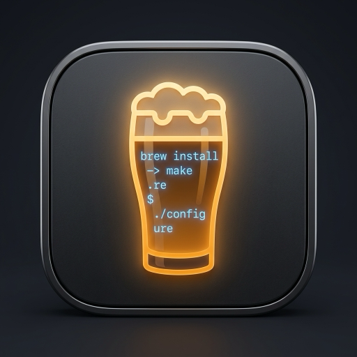

<div align="center">
  
  <h1>Homebrew Desktop</h1>
  <p><b>Native macOS GUI Dashboard for Homebrew</b></p>
  <p>Manage packages, casks, taps, background services, and system health with real-time live terminal streaming & Gemini AI assistance.</p>
</div>

---

## 📋 Table of Contents

- [Overview](#-overview)
- [Key Features](#-key-features)
- [Prerequisites](#-prerequisites)
- [How to Run](#-how-to-run)
- [How to Debug](#-how-to-debug)
- [How to Build](#-how-to-build)
- [Architecture & Tech Stack](#-architecture--tech-stack)
- [License](#-license)

---

## 🌟 Overview

**Homebrew Desktop** brings a fast, modern native macOS user interface to the Homebrew package manager (`brew`). It provides complete visibility into installed CLI formulae, GUI applications (casks), background launchd services, and third-party tap repositories without needing to memorize CLI syntax.

---

## ✨ Key Features

- 📦 **Package Management**: Browse, search, install, update, pin, and uninstall Homebrew formulae & casks.
- ⚡ **Live Terminal Console**: Stream live stdout/stderr logs for every brew operation in a sleek built-in terminal drawer.
- 🔄 **Real-Time System Sync**: Communicates directly with your native Homebrew installation (`/opt/homebrew` on Apple Silicon or `/usr/local` on Intel).
- ⚙️ **Services Controller**: Start, stop, restart, and inspect launchd background services (`brew services`).
- 🚰 **Tap Management**: View active third-party taps and easily tap/untap repositories.
- 🤖 **AI Package Advisor**: Integrated Gemini 2.5 AI for personalized CLI tool recommendations and error diagnostics.
- 📊 **Health Diagnostics**: Instant diagnostics checking for outdated packages, Homebrew environment health, and storage utilization.

---

## ⚙️ Prerequisites

- **macOS** 11.0 (Big Sur) or newer
- **Homebrew** installed (`/opt/homebrew/bin/brew` or `/usr/local/bin/brew`)
- **Node.js** 18+ and `npm`

---

## 🚀 How to Run

### 1. Install Dependencies

```bash
npm install
```

### 2. Configure Environment (Optional)

Copy `.env.example` to `.env` to enable the Gemini AI Package Advisor:

```bash
cp .env.example .env
```

Add your Gemini API key:
```env
GEMINI_API_KEY="your_api_key_here"
```

### 3. Run the App

#### **Option A: Run Native Electron App (Recommended)**
Builds the renderer assets and launches the native Electron application:
```bash
npm run electron:dev
```

#### **Option B: Run with Live Reloading**
Runs Vite dev server and Electron concurrently with live hot-reloading:
```bash
npm run electron:watch
```

#### **Option C: Web Preview Server**
Starts the web-only preview server on `http://localhost:3000`:
```bash
npm run dev
```

---

## 🐞 How to Debug

### 1. Debugging the Frontend (Renderer Process)

- Inside the Electron application window, press **`⌘ + Option + I`** (or select **View ➔ Toggle Developer Tools** in the macOS menu bar).
- Use **Chrome DevTools** to inspect React components, CSS styles, network requests, and JavaScript console errors.
- You can access `window.electronAPI` directly in the Console tab to test IPC calls:
  ```javascript
  // Test system info IPC
  await window.electronAPI.getSystemInfo();

  // Test real Homebrew data fetch
  await window.electronAPI.fetchAllData();
  ```

### 2. Debugging the Electron Main Process

- Terminal output from `npm run electron:dev` displays all Electron main process logs, including IPC handler logs, system command execution, and file paths.
- Search for `[Electron]` log prefixes in your terminal output:
  ```text
  [Electron] Fetching real Homebrew data from system...
  [Electron] Loading built file: /path/to/dist/index.html
  ```

### 3. Live Terminal & Command Logs

- Toggle the **Console** button in the app's top bar to inspect command logs and exit codes.
- Streams stdout and stderr directly from spawned `brew` processes.

---

## 🛠️ How to Build

To compile renderer assets and generate distribution packages for macOS:

```bash
npm run electron:build
```

### Build Artifacts

The built files will be output to the `release/` directory:

- 🍏 **`release/mac-arm64/Homebrew Desktop.app`**: Standalone macOS Application Bundle.
- 💿 **`release/Homebrew Desktop-1.0.0-arm64.dmg`**: macOS Installer Disk Image.
- 📦 **`release/Homebrew Desktop-1.0.0-arm64-mac.zip`**: Compressed application package.

> **Launching Note**: Double-click `Homebrew Desktop.app` or install via the `.dmg` file to run the app natively without opening a terminal window.

---

## 🏗️ Architecture & Tech Stack

| Layer | Technology |
| :--- | :--- |
| **GUI Framework** | React 19, TypeScript, TailwindCSS v4, Motion |
| **Desktop Runtime** | Electron 34, Node.js IPC |
| **Icons & Design** | Lucide Icons, macOS Sequoia Vibrant Dark Theme |
| **AI Integration** | `@google/genai` (Gemini 2.5 Flash) |
| **Bundling & Packaging** | Vite 6, Electron Builder, esbuild |

---

## 📄 License

MIT License © 2026 Traveling Tech Guy LLC